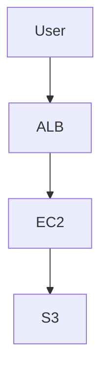

# Homework Assignment: Week 3
## Overview
This weeks homework covers launching a GitHub repository and learning Linux fundamentals.

- **Date:** 09-23-2025
- **Author:** [Kirk Alton](https://github.com/KirkAlton-Class7)
- **Class Folder:** N/A
- **Repo Link:** https://github.com/KirkAlton-Class7/hmwk_09.23.2025_class7

---

## Deliverables
- ✅ [Week 1 Homework](https://github.com/KirkAlton-Class7/hmwk_09.09.2025_class7)
- ✅[Bahga Box 2.1 (Week 1)](https://github.com/KirkAlton-Class7/bahga_box_2.1_class7)
- ✅ [Bahga Box 2.2 (Week 1)](https://github.com/KirkAlton-Class7/bahga_box_2.2_class7)
- ✅ [Be A Man Challenge 1.1](https://github.com/KirkAlton-Class7/bam_1.1_class7)
- ✅ [Be A Man Challenge 1.2](https://github.com/KirkAlton-Class7/bam_1.2_class7)
- ✅ [Week 2 Lab Notes](https://github.com/KirkAlton-Class7/hmwk_09.23.2025_class7/blob/main/week_2/lab_notes_09.16.2025.md)
- ✅ [Week 3 Lab Notes](https://github.com/KirkAlton-Class7/hmwk_09.23.2025_class7/blob/main/week_3/lab_notes_09.23.2025.md)
- ✅ [Week 3 In Class Activity (improved outside of class)](https://github.com/KirkAlton-Class7/hmwk_09.23.2025_class7/blob/main/week_3/dusty_cloud_prayer.md)
- [IN PROGRESS] Week 3 KillerCoda Screenshots
- ✅ Be A Man Challenge 3.1
- [IN PROGRESS] Be A Man Challenge 3.2

---

## Step-by-Step Instructions
> [!TIP]  
> Use numbered lists for clarity. This ensures each assignment can be repeated consistently.

### Step 1: Provision Resources
1. Launch an EC2 instance using AWS Console or Terraform  
2. Apply security group with inbound HTTP access  
3. Save configuration details  

```hcl
# Example Terraform snippet
resource "aws_instance" "web" {
  ami           = "ami-123456"
  instance_type = "t2.micro"
}
```

### Step 2: Configure Services
1. SSH into the EC2 instance (or access container/pod if Kubernetes-based).  
2. Install the required software stack (e.g., Apache, Nginx, Docker, or Jenkins).  
3. Apply environment-specific configuration (e.g., system packages, config files).  
4. Deploy application or custom content to the service.  
5. Enable and start the service to persist across reboots.  

```bash
# Example script for Apache on Amazon Linux
sudo yum update -y
sudo yum install -y httpd
echo "Hello from $(hostname)" > /var/www/html/index.html
sudo systemctl enable httpd
sudo systemctl start httpd
```

```shell
# Example script for Nginx on Ubuntu
sudo apt update -y
sudo apt install -y nginx
echo "Hello from $(hostname)" | sudo tee /var/www/html/index.html
sudo systemctl enable nginx
sudo systemctl start nginx
```

```shell
# Example Jenkins install (Ubuntu/Debian)
sudo apt update
sudo apt install -y openjdk-11-jre
wget -q -O - https://pkg.jenkins.io/debian/jenkins.io.key | sudo apt-key add -
sudo sh -c 'echo deb http://pkg.jenkins.io/debian-stable binary/ > \
    /etc/apt/sources.list.d/jenkins.list'
sudo apt update
sudo apt install -y jenkins
sudo systemctl enable jenkins
sudo systemctl start jenkins

```

> [!TIP]  
> Replace with Terraform provisioners or Ansible playbooks for automation when scaling beyond a single instance.  

---

### Step 3: Verification
- [ ] Access the public IP or DNS of the deployed service in a browser  
- [ ] Confirm the page loads with the expected custom message or app response  
- [ ] Validate service status via CLI  

```bash
# Verify Apache is running
systemctl status httpd

# Verify Nginx is running
systemctl status nginx

# Verify Jenkins is running
systemctl status jenkins
```

- Save a screenshot of the working service  
  - Example: Web browser showing the EC2 public IP with the custom message  
  - Example: Jenkins dashboard with build history visible  
  - Example: Nginx welcome page after installation  

---

### Step 4: Teardown
1. Terminate the EC2 instance (or delete Kubernetes deployment/pod).  
2. Remove associated resources:  
   - Security groups  
   - Key pairs  
   - EBS volumes / Persistent storage  
3. If Terraform was used, run:  

```bash
terraform destroy -auto-approve
```

4. Confirm all resources are deleted to avoid unexpected costs.  
   - [ ] Verify in AWS Console, GCP Console, or Azure Portal  
   - [ ] Run CLI commands to confirm cleanup  

```bash
# AWS example
aws ec2 describe-instances --filters "Name=instance-state-name,Values=running"

# GCP example
gcloud compute instances list

# Azure example
az vm list --output table
```

- [ ] Ensure no leftover security groups, IAM roles, or persistent storage remain  
- [ ] Double-check billing dashboard for unexpected charges  
- [ ] Document the cleanup confirmation in your README  

---

## Images & Diagrams
> [!NOTE]  
> Insert screenshots, diagrams, or architecture charts here.  

- **Screenshot 1:** Running service (web page, Jenkins dashboard, etc.)  
- **Screenshot 2:** Customized content for challenge tasks  
- **Diagram:** Deployment architecture (optional, e.g., via Mermaid, draw.io, or Lucidchart)  



## Checklists
- [ ] Repo structured by week/date  
- [ ] Scripts saved as `.txt` in repo  
- [ ] Screenshots included in `/images` folder  
- [ ] README updated with setup + teardown steps  
- [ ] Group leader/mentor review complete  
- [ ] All footnotes referenced properly  
- [ ] Diagrams included for architecture (if applicable)  
- [ ] Verification screenshots uploaded  
- [ ] Teardown logs or confirmation documented  

---

## Notes & Challenges
> [!WARNING]  
> Use this section to document issues, blockers, or workarounds.

- Issue 1: [Describe problem and resolution]  
- Issue 2: [Describe problem and resolution]  
- Known limitations: [Document any skipped steps or partial completions]  
- Lessons learned: [Capture insights for future assignments]  

---

## Assessment / Reflection
> [!NOTE]  
> Use this section to connect hands-on work back to **broader cloud, DevSecOps, or engineering principles**. This helps you build a study notebook while completing homework.

### What I Learned
- Key insight 1: [e.g., Learned how security groups control inbound/outbound traffic]  
- Key insight 2: [e.g., Understood how Terraform state locking prevents conflicts]  
- Key insight 3: [e.g., Experienced troubleshooting EC2 connectivity issues]  

### Broader Connections
| Category | Concept | How This HW Connects |
|----------|---------|-----------------------|
| **Architecture & Design** | Scalability, reliability, cost optimization | Applied auto scaling with EC2 for availability |
| **Security & Compliance** | Identity, access, encryption, least privilege | Configured IAM roles for restricted access |
| **Operations & Automation** | CI/CD, IaC, observability | Used Terraform + CloudWatch to deploy and monitor |
| **Collaboration & Process** | Version control, teamwork, documentation | Shared repo structure + documented teardown |

---

## Group / Peer Work
> [!TIP]  
> Use this section to capture collaboration details, reviews, or approvals from group leaders and peers.

### Participants
- **Student:** [Your Name]  
- **Group Leader:** [Leader Name]  
- **Peers Collaborated With:** [Names]  

### Review / Approval
- ✅ Assignment reviewed by [Leader Name] on [Date]  
- ✅ Feedback provided: [Summarize key feedback]  
- ✅ Changes applied: [Summarize updates made after review]  

### Notes
- Coordination method: [Slack, Discord, Zoom, In-person]  
- Division of tasks: [Who did what, if applicable]  


## References
- AWS Docs: [Link](https://docs.aws.amazon.com/)  
- Terraform Docs: [Link](https://developer.hashicorp.com/terraform/docs)  
- Jenkins Docs: [Link](https://www.jenkins.io/doc/)  
- GitHub Docs: [Link](https://docs.github.com/)  
- KillerCoda: [Linux Fundamentals](https://killercoda.com/pawelpiwosz/course/linuxFundamentals)  

---

## Footnotes
[^1]: Screenshots must clearly show resource IDs, commands, or outcomes.  
[^2]: Ensure teardown instructions are validated by repeating the process.  
[^3]: Use consistent repo structure across all weeks to simplify grading.  
[^4]: Checklist items are cumulative — keep updating instead of starting from scratch each week.  

