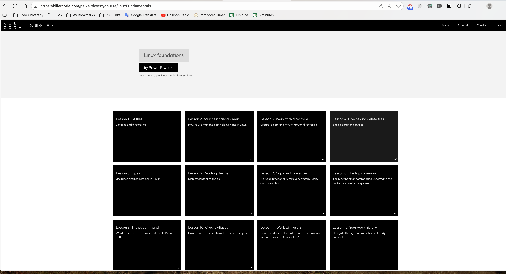

# Killer Coda Exercises



<br>
<br>


## <i>Linux: Lesson 1</i>

> [!WARNING]  
> NOTES STILL IN PROGRESS. NEED TO BE EDITED AND CLEANED UP.

Home Directory
macOS: `/Users/<YOUR-USERNAME>/`

`mkdir` make directory
`rmdir` remove directory
`rm -rf <directory>
- `-r` is recursive. This continually applies the command on all folders within the directory.
- `-f` is force. This forces execution of the operation, regardless of system behavior that may interfere or ask for confirmation. **Use with caution, and only if you know what you're doing.**
`touch` create a file
`rm` remove a file

`mv` move file
```sh
mv <./object-path> <./target-directory>
```
Examples
```sh
mv ./chewbacca.jpg /users/kirk/Documents/photos/Columbian
mv /users/Documents/photos/chewbacca.jpg /users/kirk/Documents/photos/Japanese
```

`cd ~` Jumps to the home directory

`pwd` = print working directory
Shows current directory in terminal

For relative file paths, use ./

Ex. Current directory: /users/kirk
Navigate to TheoWAF

```sh
./TheoWAF
```

You can also just type the path without ./
```sh
TheoWAF
```

Both commands navigate to:
```sh
/users/kirk/TheoWAF
```

`cd ..` Takes you up one directory
Add another `.` to go up +1 directory

`cd -` Takes you to the previous directory

`ls` Lists the contents of the current directory (aka "Lemme See" or "List Sh!t")

`ls --color=no` Turns off color for ls command

`ls --color=yes` Turns on color for ls command

`clear` Clears the terminal screen

What you pass after the command `-` or `--` is an argument
`-` is used to pass one letter arguments like "i" or "h"
`--` is used to pass arguments that contain more than one letter. Typically it will be an english word.

`ls -l`
`l` means long listing format.
This provides user friendly information about permissions, hard links, owner, groups, size, date and time, and filename.

`ls -n`
Works like `ls -l` but changes the user-friendly names to User Identifier (UID) and Group Identifier (GID) numbers.

For hidden objects, Linux uses `.` at the beginning of the object name. These are called `dotfiles`.

`ls -a`
Lists **all** files, including dotfiles and special entries. This shows dotfiles, regardless of their location.
When viewing results:
`.` is the current directory
`..` is the parent directory


`ls -A`
	Lists **almost all** files (excludes `dotfiles`)
	Excludes special entries `.` (current directory) and `..` (parent directory)

`.` and `..` can also be used with `ls`

`ls .` lists files in the current directory
`ls ..` lists files in the parent directory

Sorting
`ls` sorts alphabetically by default

Linux has different time stamps
`atime` - the last time a file was accessed
`mtime` - the last tie a file was modified
`ctime` - last metadata modification time (permissions changed, location of the file changed, etc.)

`date` - shows current time and date

`ls -t` lists files and sorts by last modification time (newest first)

Run `ls -ltu` to put in long list `-l`, sort by modification time `-t`, and show last modification time `u` 

The most useful way to run sorting commands is with the following arguments:

`ls -lta`  
- Lists files in long list form, sorted by last access time (`atime`), and shows last access time.
    
`ls -ltu`  
- Same as `ls -lta` but doesn't show `dotfiles` 
`ls -ltc`  
- Lists files in long list form, sorted by last status change time (`ctime`), and shows time of last metadata change (like permission, ownership change, etc.).

Everything in Linux, including arguments, is case-sensitive.
`ls -s` shows file size in blocks
`ls -S` sorts files by size (largest first)

The most useful way to sort by size is by running `ls -lS`

`--human-readable`, also known as `-h` transforms information to human readable forms 

`ls lh` shows long list with human readable text. For example, instead of 156940 blocks, file size shows as 154K.

`ls -lSh` shows long list, sorted by size, and in human readable format

`--format` Can be used when scripting and `ls` is used for input for other parts of the script.

`ls --format=long` same as `ls -l`

`ls --format=commas` same as `ls -m`
Formats the list with commas as the delimiter

`ls -lQ` prints the filenames in quotes, one file per line.

`--time-style` changes the way the date is formatted in long format

`ls -l --time-style=locale` (default for `ls -l`)
`ls -l --time-style=iso`
`ls -l --time-style=full-iso` 


`--time-style` changes the **date/time format** shown in **long listing format** (`ls -l`).
    
- Useful when you want **consistent, unambiguous timestamps** (e.g., for scripting, logs, or international teams).
    


`ls -l --time-style=locale`
Uses your system’s local date format (default).
- Example: `Sep 27 14:32`

`ls -l --time-style=iso`
Uses ISO 8601 date format (short).
 - Example: `2025-09-27 14:321`

`ls -l --time-style=long-iso`
Uses ISO format with year included.
 Example:`2025-09-27 14:32`

`ls -l --time-style=full-iso`
Full ISO 8601, including seconds and timezone.
- Example: `2025-09-27 14:32:05.123456789 -0400`

You can also pass a custom format:
```bash
ls -l --time-style="+%Y/%m/%d %H:%M:%S"
```

Output:
```
2025/09/27 14:32:05
```

Useful arguments

`ls -al --author` - prints the username of the creator of a file
`ls -ald` - prints directory level permissions
`ls -ali` - prints inodes
`ls -alR` - recursively prints all subdirectories
`ls -alr` - prints lists in the reverse order
`ls -alSr` - prints list by file size, in the reverse order
`ls --version` - prints the version of the binary
`ls --help` get help with commands and arguments
<br>
<br>

## <i>Linux: Lesson 2</i>
`man man` prints all pages of the Linux manual
`man` + `<command>` - prints the manual page for that command command
Example: `man ls`  prints the manual page for the `ls` command

`whatis <command>` - shows a short description of the functionality of a command.
ex `whatis ls` shows information about the `ls` command.

`man -k <command>` searches for the given command through all manual pages and returns them as output.
`man -w <command>` returns the location of the file from where the pages is rendered

<br>
<br>

### <i>Linux: Lesson 3: Directories</i>

`mkdir <dir-name>{IndexStart# ..IndexEnd#}`
Creates multiple directories.
Example: `mkdirk tesdir{1..10}` creates 10 directories (testdir1 . . . testdir10)

`mkdir -p<dir-Name>/<sub-dir-name>{IndexStart#..IndexEnd#}
Creates a parent directory that is filled with the number of indexed sub directories, named accordingly.
Tip: Index can be added to parent directory to create multiple parent directories as well.
Example: `mkdir -p parent_directory{1..25}/child_directory{1..50}`
Creates 25 folders named "parent_directory#" filled with 50 subdirectories named "child_directory#"

`ls -l <dir-path>` list files in a directory (absolute or relative path)
Example: `ls -l /users/kirk/Documents` or if in Documents, `ls -l my_class_documents

`echo $HOME` prints the absolute path of the home directory
`cd $HOME` navigates to home directory 
`cd ~` navigates to home directory (quicker)
`cd` navigates to the home directory **(quickest)**

* = wild card
? = any single character

rm -rf <dir>


PIPES AND REDIRECTIONS

grep = search for output pattern (output can be the file or another command)

wc = word count
wc -l = number of lines

sort = sort the output in alphabetical order

Pipe: | = combine commands
Ex: command 1 | command 2 | command 3 | etc.
The output of command 1 is take as input for command 2, and so on.

cat = print the full contents of a file
One of the most commonly used commands
(conCATenate)

uniq =
uniq always works best with `sort` and `sort` is first

> = redirect. Sends the output on the other side of the sign to the file on the right side of the sign.
- If file doesn't exist, create it
- Add content from redirected output
- If file exists and it is not empty, clear the file and write the redirected output in empty file

>> redirect with append. This adds information to the end of the document.

awk ???

can redirect either way

The input redirection, <, is used mostly to redirect content to file.


VIM Basics
i = insert mode
Escape = switch between modes
: = command mode
:q quit
:wq quit without saving
:wq write and quit (saves cahnges)
VIM starts in commandmode

`view' <file-name> opens VIM in read only mode.
:q to quit


`more <file-name>` allows you to view contents of a file and move forward by pressing enter. Press q to quite.

`less <file-name>` is more sophisticatd than. more. It allows you to go navigate the contents of a file using the arrow keys. Also allows to search for strings using `/ <STRING>` use `n` and `N` to go the next result and previous result respectively.

`head` of a file is the first 10 lines
`tail` is the last 10 lines.

-n allows you to see a custom number of lines
`head n2` testfile
`head n22` testfile

`tree <dir>`
Recursively shows the content of the directory. Recursively means if there is a subdirectory, its content will be shown as well.


`cp <source-target> <target-dir>`
copy file


ex. cp one.txt ../MyFiles

The file  one.txt was in the directory. It was copied to the parent directory in  /MyFiles
.. (go to parent directory, one level higher)


Copy

Copy multiple files at once.
`cp <target 1> <target2> <target3> <target-dir>`


cp file1tocopy file2copy file3tocopy targetlocation


* wildcard replaces all characters with any length.
Ex: cp my*file.txt (all text files with "my" anything in between and "file".txt)

Coy an entire directory
`cp -R <target> <target-dir>

`mv` move driectory

`mv <source-target> <target-dir>`


`diff`
Compares the contents of two files. No output means the files are exactly the same.


`who` shows information about who is logged in


`top` Is a terminal based real-time system monitor. The dashboard shows
1. How busy the system is (load average, CPU usage)
2. Which processes are consuming resources
3. How memory and swap are being used
4. What's happening ***right now***.

Press `q` to quit the `top` dashboard.


The load average, is the first line in `top`. It is very important.
If you see a load average: 0.52, 0.58, 0.59
These numbers represent the load average for the system in the last 1, 5 and 15 minutes.
These show the average number of processes running and waiting for CPU time.
It is crucial to understand, that these values need to be evaluated in relation to the number of CPUs, Cores,or Threads.
For a system with 1 core, a load average of 10 is a massive overload, but for a system with 12 cores, this is closer to idling.

`sysctl -n hw.ncpu` This allows you to check the number of cores on a Mac Machine

`uptime` shows the load average


## Load Average = Work Queue Size

Think of **cores as checkout lanes** in a grocery store:

* **4 cores → 4 checkout lanes**
* **Load Avg = 4** → all lanes are busy, no waiting
* **Load Avg = 2** → 2 lanes in use, 2 empty
* **Load Avg = 6** → all 4 lanes busy, and 2 people waiting in line

So load average is just the "line length" compared to the number of available lanes (CPU cores).

---

## Quick Examples

* **1-core machine**

  * Load 1.0 → maxed but OK
  * Load 2.0 → 1 busy, 1 waiting

* **4-core machine**

  * Load 2.0 → half used
  * Load 4.0 → fully used
  * Load 8.0 → double loaded, backlog forming

* **12-core MacBook Pro (yours)**

  * Load 6.0 → ~50% busy
  * Load 12.0 → fully loaded
  * Load 18.0 → ~150% loaded, processes waiting


* **Short spikes** above core count = usually fine
* **Sustained overload** → sluggish apps, slow builds, fans ramping
* **In cloud**: A steady overload = you need a bigger instance type (more vCPUs)


# Process States in `top`

The **second line in `top`** shows the status of all processes:

Example:

```sh
Tasks: 6 total, 1 running, 5 sleeping, 0 stopped, 0 zombie
```

* **total** → All processes in the system
* **running** → Actively using CPU right now
* **sleeping** → Waiting for something (e.g., I/O operation)
* **stopped** → Suspended processes (e.g., paused with `Ctrl+Z` or by a debugger)
* **zombie** → Dead processes that have finished but not cleaned up by their parent

---

## Process State Codes (STAT Column in `top`)

| Code  | State                 | Meaning                                         |
| ----- | --------------------- | ----------------------------------------------- |
| **R** | Running               | Actively on CPU                                 |
| **S** | Sleeping              | Idle, waiting for an event                      |
| **D** | Uninterruptible Sleep | Waiting on I/O (disk, network)                  |
| **T** | Stopped               | Suspended by job control (`Ctrl+Z`) or debugger |
| **Z** | Zombie                | Finished execution but not reaped by parent     |

---

**Key point:**

* **Stopped (T)** in `top` = **Suspended** (not killed, can be resumed with `fg` or `bg`).
* **Zombie (Z)** = truly dead, just waiting for cleanup.


---

# `top` — Third Line (CPU Usage)

Example from `top`:

```
%Cpu(s): 13.9 us, 9.5 sy, 0.0 ni, 76.3 id, 0.0 wa, 0.4 hi, 0.0 si, 0.0 st
```

This line shows **CPU utilization split into categories**.

---

## CPU Usage Fields

| Code   | Meaning             | Explanation                                                                                                                             |
| ------ | ------------------- | --------------------------------------------------------------------------------------------------------------------------------------- |
| **us** | User                | % of CPU used by user processes (your applications, sessions)                                                                           |
| **sy** | System              | % of CPU used by system/kernel processes                                                                                                |
| **ni** | Nice                | % of CPU used by processes with adjusted priority (niceness). Ranges from **-20 (highest priority)** to **+19 (lowest priority)**       |
| **id** | Idle                | % of time the CPU is idle (doing nothing)                                                                                               |
| **wa** | I/O Wait            | % of time CPU is idle **waiting for I/O** (disk, network, etc.) — high values may indicate bottlenecks outside CPU                      |
| **hi** | Hardware Interrupts | % of CPU servicing hardware interrupts (keyboard, network card, etc.)                                                                   |
| **si** | Software Interrupts | % of CPU servicing software interrupts (handled by the kernel)                                                                          |
| **st** | Steal Time          | % of CPU time taken by the **hypervisor** (VMs waiting for CPU resources on a shared host). Important in cloud/virtualized environments |

---

## Key Insights

* **High `us`** → Application-heavy load
* **High `sy`** → Kernel/OS overhead
* **High `wa`** → I/O bottleneck (e.g., disk, network latency)
* **High `st`** → VM is starved by the hypervisor (common on noisy neighbors in cloud)
* **High `id`** → System is underutilized (good if you’re not running workloads)

---

### Analogy

Think of your CPU as a chef in a kitchen:

* **us** = cooking for guests (user programs)
* **sy** = cleaning dishes (system tasks)
* **ni** = cooking VIP meals first (priority scheduling)
* **id** = waiting around
* **wa** = waiting for ingredients to arrive (I/O)
* **hi/si** = responding to alarms or interruptions
* **st** = another chef takes over your stove (hypervisor steals cycles)

---

With this, when you see `%Cpu(s)` in `top`, you know **what kind of work your CPU is really doing** — not just “busy vs idle.”

Here’s a **clean, optimized markdown version** of your notes for the 4th, 5th lines, and the process list in `top`:

---

# `top` — Fourth & Fifth Lines (Memory and Swap)

Example:

```
MiB Mem :  16217.5 total,   6184.9 free,   9808.7 used,    224.0 buff/cache
MiB Swap:  49152.0 total,  48436.2 free,    715.8 used.   6278.3 avail Mem
```

---

## Memory (Physical RAM)

* **total** → Total physical memory (RAM)
* **free** → Completely unused memory
* **used** → Memory actively used by processes
* **buff/cache** → Memory used by:

  * **Buffers** (kernel metadata, I/O operations)
  * **Cache** (page cache, speeding up file access)

**Note:** Linux/macOS use memory aggressively for caching.

* High “used” memory is often normal.
* What matters is **`available`** memory.

---

## Swap (Virtual Memory)

* **total** → Swap space available on disk
* **free** → Unused swap
* **used** → Swap space currently being used
* **avail Mem** → How much memory can be allocated to new apps **without swapping**

**Tip:**

* If **swap usage is high**, system may be under memory pressure.
* In VMs/cloud, high swap often means you need a bigger instance or to optimize memory usage.

---

# Process List (Below the Header in `top`)

This is the **real-time table of running processes**.

| Field       | Meaning                                                                |
| ----------- | ---------------------------------------------------------------------- |
| **PID**     | Process ID (unique identifier)                                         |
| **USER**    | Owner of the process                                                   |
| **PR**      | Priority (default set by kernel scheduler)                             |
| **NI**      | Niceness value (process priority hint, -20 = high priority, +19 = low) |
| **VIRT**    | Virtual memory used (all memory allocated, including swap + shared)    |
| **RES**     | Resident Set Size = actual physical RAM used                           |
| **SHR**     | Shared memory (can be shared with other processes, e.g., libraries)    |
| **S**       | Process state (R, S, D, T, Z — see earlier notes)                      |
| **%CPU**    | % of CPU the process is using                                          |
| **%MEM**    | % of RAM the process is using                                          |
| **TIME+**   | Total CPU time consumed by the process                                 |
| **COMMAND** | The command/program name running                                       |

---

## Key Insights

* **VIRT vs RES vs SHR**

  * `VIRT` = “claimed” memory (can be much larger than actual usage).
  * `RES` = “real” memory used in RAM.
  * `SHR` = memory shared with others (saves space).

* **PR & NI** matter for scheduling:

  * High-priority tasks (low NI) get CPU time sooner.
  * Useful for tuning workloads.

---

With this, you can read `top` from **load averages** → **CPU usage** → **memory pressure** → **which process is hogging what**.

--


# `ps` — Process Status

`ps` = process status. It gives a snapshot of running processes (unlike `top`, which updates in real time).

---

## Basic Usage

```bash
ps
```

* Shows only processes tied to the current shell session.
* Fields:

  * **PID** → process ID
  * **TTY** → terminal controlling the process
  * **TIME** → total CPU time used
  * **CMD** → command being run

---

Note: Unlike most commands, `ps` accepts both **BSD-style (no dash)** and **Unix-style (with dash)** options.

---

## Process States (`STAT`)

| Code  | Meaning                                     |
| ----- | ------------------------------------------- |
| **R** | Running / runnable                          |
| **S** | Sleeping (waiting for event)                |
| **D** | Uninterruptible sleep (I/O wait)            |
| **T** | Stopped by signal or job control (`Ctrl+Z`) |
| **t** | Stopped by debugger                         |
| **Z** | Zombie (terminated, not reaped by parent)   |
| **I** | Idle kernel thread                          |
| **X** | Dead (rare, should not appear)              |

**Additional flags**:

* `<` → high priority
* `N` → low priority (nice)
* `s` → session leader
* `l` → multi-threaded
* `+` → foreground process group

---


# Commonly Used `ps` Combinations

Most system administrators rely on a few `ps` invocations regularly.

---

## Standard Views

* **`ps -ef`**

  * Full-format listing (Unix style).
  * Commonly used to determine the PID of a process.

* **`ps aux`**

  * Full-format listing (BSD style).
  * Widely used to view PID, user, state, CPU, and memory usage.

* **`ps aux --forest`**

  * Displays process hierarchy (tree view).
  * Alternative: `pstree` (simpler but less detailed).

--


## Aliases

* **`alias NAME="command"`** → defines an alias (creates a shortcut mapping).
* **`unalias NAME`** → deletes an alias definition.
* Aliases are **session-scoped**: they only exist in the current shell unless defined in a startup file.

### Making Aliases Persistent

It is highly recommended NOT to add aliases directly into configuration files (`.bashrc`, `.zshrc` `.profile`, etc.). Instead, a safer, more organized approach is to keep them in a dedicated file for aliases (e.g., `~/.bash_aliases` or `~/.zsh_aliases`) and source it from your shell config by adding this snippet to your configuration file

```bash
# Load aliases if the file exists
if [ -f ~/.bash_aliases ]; then
    . ~/.bash_aliases
fi
```

This approach:
- Increases portability — allows you tocopy a single file to share aliases across machines.
- Isolates workflows — keeps aliases separate from PATH, exports, and functions.
- Keeps things organized — your main shell config remains uncluttered.