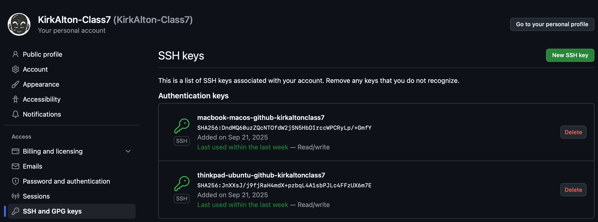

# Setting Up SSH Keys and Creating a GitHub Repository

### Check for existing SSH keys [^1]
1. Open Terminal
2. Enter `ls -al ~/.ssh` to show existing SSH keys
3. If an error states  that ~/.ssh doesn't exist, there are no SSH key pairs in the default location.
4. Generate a new SSH key (if none exist).
<br>
<br>

### Generate a new SSH key [^2]
1. Open Terminal
2. Enter `ssh-keygen -t KEYNAME -C "your_email@example.com"`
    - Give your key a descriptive name that is descriptive. A naming system that includes the device, environment, and purpose will help you organize your keys. e.g., `macbook-macos-github-kirkaltonclass7`
    - The phrase after `-C` is a label. Feel free to label your key however you see fit. e.g., `-C "GitHub Key @KirkAlton-Class7`
3. When instructed to "Enter a file in which to save the key", press enter for the default location.
4. When prompted for a passphrase, press enter to leave blank (no passphrase). Alternatively, you can type a passphrase for added security, then press enter.
5. Press enter again (no passphrase) or type the passphrase again to confirm.
6. If you encounter issues, refer to the GitHub documentation for additional troubleshooting steps.
<br>
<br>

### Add your SSH key to the ssh-agent [^2]
1. Start the ssh agent:
``` sh
eval "$(ssh-agent -s)"
 ```
2. If using macOS,Sierra 10.12.2 or higher: edit the `~/.ssh/config` file to automatically load keys into the ssh-agent and store passphrases in your keychain.
    - Check if the `~/.ssh/config` file exists in the default location.
``` sh
open ~/.ssh/config
 ```
3. If the file doesn't exist, create it.
``` sh
touch ~/.ssh/config
```
4. Modify `~/.ssh/config` to contain the following lines:
```python
Host github.com
  AddKeysToAgent yes
  UseKeychain yes
  IdentityFile ~/.ssh/id_ed25519
```
- <b>Note:</b> You can omit the `UseKeychain` line if you did not add a passphrasae to the key.
<br>

5. If you encounter issues, refer to the GitHub documentation for additional troubleshooting steps.
<br>
<br>

### Add the SSH Key to Your GitHub Account [^3]
1. Open terminal and navigate to the
2. Copy the contents of your public SSH key:
```sh
$ pbcopy < ~/.ssh/KEYNAME.pub
```
3. If `pbcopy` doesn't work, locate the hidden `.ssh` folder in your OS file structure, then open it in a text editor and copy it to the clipboard.
4. On GitHub, click your profile and select "Settings".
5. In the "Access" sidebar, click "SSH and GPG Keys"
6. Click "New SSH Key" or "Add SSH Key".
7. Add a descriptive label for the new key.
8. Select the type of key (authentication or signing).
9. Paste the contents of your public key.
10. Click "Add SSH Key".
<br>
<br>

<br>
<br>


### Create a new repo on GitHub
1. In upper lefthand corner click "repositories"
2. In upper right hand corner click "new." Name your repository. Choose a naming system that helps you organize your repos. e.g., homework_09.23.2025_class7
3. Add a brief description of your repo.
4. Make public if sharing
5. Click "create repository"
6. If the quick setup screen shows, click SSH and copy the contents of the field.
7. If inside your repo, click "Code" select "SSH" and copy the contents of the field
e.g., `git@github.com:KirkAlton-Class7/hmwk_09.23.2025_class7.git`
8. This is your repo's remote. Paste it in a separate text file. It will be used in the next step.
<br>
<br>


### Create a local repo[^4]
1. Navigate to where you store your repos and creae a new directory.
2. Open terminal and navigate to the repo directory
3. Create a local repo using `git init`
3. Add your Github remote (paste your remote information from the previous section) and name it "origin"
`git remote add origin <your remote>` 
4. Rename the feault branch from "master" to "main" (preferred name)
`git branch -M main`
5. Stage files for upload using `git add <files to stage>`
6. Commit the staged
`git commit -m "<message information>"`
7. Push the changes to your GitHub repo
`git push -u origin main`

After first push, you can run `git push` to push files to the repo
You can run `git pull` to pull files from the repo and sync changes.
You an set up the repo to share the files and sync changes with multiple machines.

<ins>References</ins> <br>
[^1]Checking for existing SSH keys: https://docs.github.com/en/authentication/connecting-to-github-with-ssh/checking-for-existing-ssh-keys <br>
 
[^2]Generating a new SSH key and adding it to the ssh-agent: https://docs.github.com/en/authentication/connecting-to-github-with-ssh/generating-a-new-ssh-key-and-adding-it-to-the-ssh-agent <br>

[^3]AdAdding a new SSH key to your GitHub account: https://docs.github.com/en/authentication/connecting-to-github-with-ssh/adding-a-new-ssh-key-to-your-github-account <br>

[^4]Basic Git Workflow: https://github.com/KirkAlton-Class7/aaron_notes_class7/tree/main/092725#github-setup